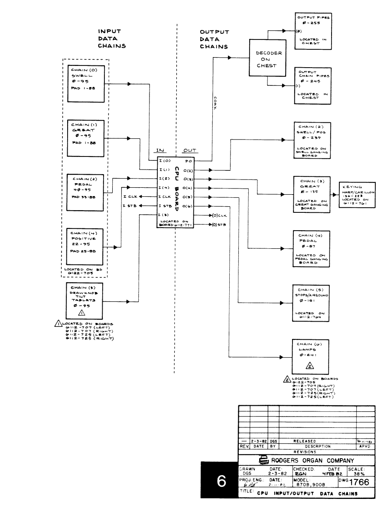
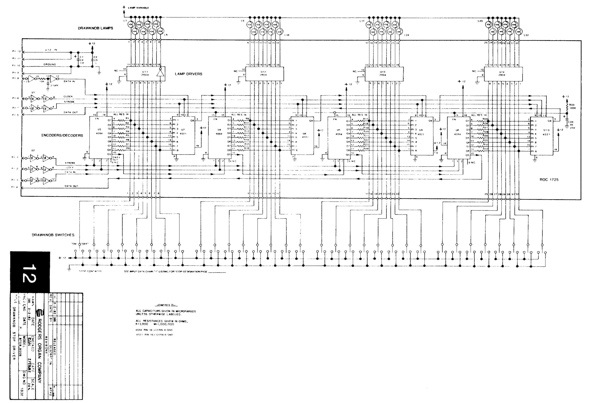

# Rodgers 890 Westminster MIDI Project

## Overview- 

When installed and used correctly, this project:

- allows the 890 console to be used as a MIDI controller/receiver
- prevents the 890 from emitting any original analog sounds
- is non-destructive to the original analog tone generation
- gives the option to revert back to the original 890 analog tone generation

## Theory

The 890 reads in keyboards/pistons/stops using 4021 shift registers.
There are five data input chains:
- swell
- great
- pedal
- choir
- drawknobs/tablets

The 890 sets lamp outputs using 4094 shift registers into 2804 transistors.
There are six output chains:
- pipe chest
- swell/choir
- great
- pedal
- stops
- lamps

We will be using all the input chains since we are using almost every input, but only the sixth output for lamps since we are only driving lamps.

---
### MIDI Latency

Every MIDI note command take approximately 1 millisecond to transmit.
We have over 90 lamps that can be changed at any time from the MIDI input.
This means if there are 50 lamp changes, it will take at least 50ms before the processor empties out the MIDI receive queue.
The acceptable time between note refreshing is 10ms.
If the organist is playing notes constantly and presses a piston that changes more than 10 lamps, there will theoretically be a delay before the next note refresh.

There are several solutions to this issue.

### *Solution 1: Hardware separation of keyboards and stops*

We can use one processor and MIDI port to process all the keyboards and their corresponding pistons and another processor and MIDI port to handle all the stops and lamps.
USB-MIDI interfaces sometimes feature multiple MIDI ports which are completely independent of each other.
This would allow one processor to dedicate its MIDI port to sending keyboard/piston note commands with no connection to the stops/lamps.
The other processor would be able to spend as much time as needed to receive MIDI notes and update lamps.

### *Solution 2: MIDI receive processing limits*

During each loop, we check if `MIDI.read()` is true (if there is an incoming message).
We continue to process MIDI messages in each loop until the incoming queue is empty.
However, if we receive more than 10 note commands at once, that breaks the limit of 10ms.
Before each time we check for an incoming message, we check to see if more than 10ms has elapsed since the last keyboard scan.
We do not update the lamps until the entire message queue has been emptied so as not to possibly create a ripple effect.
This complicates the code a little bit but allows the entire organ to run off of one MIDI port.

---
### Drawknobs and Tilt Tabs

Each drawknob and tilt tab has a lamp, an "on" contact, and an "off" contact.
When you turn the stop on, you pull the drawknob and release.
The lamp turns on and the drawknob moves back to its default center position.
The same goes for pushing the stop to turn it off.
The act of pushing or pulling a stop physically changes the state of the 2804 transistor and also changes the state of the corresponding 4021 shift register.
This means that there is a possibility of echoing a MIDI note on or note off command coming from the organ software.

To solve this issue, when receiving MIDI note commands, we `or` the "previous state" word with any reveiced MIDI note command. When scanning for changes on the next loop, those changes that are now read in do not trigger new MIDI note commands to be sent back to the organ software.

